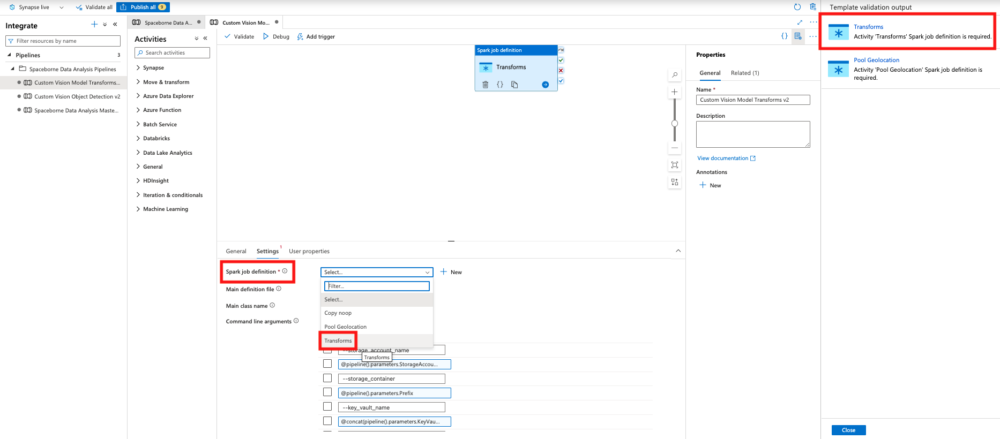

If you've landed on this page from Synapse gallery, you should have the required infrastructure and the Custom Vision model package ready. If this is true proceed further; otherwise visit the [infrastructure deployment](https://github.com/Azure/Azure-Orbital-Analytics-Samples/tree/main/deploy#infrastructure-deployment) section of the Readme and provision the required infrastructure and the package first. 

The instructions on this page guide you through configuring the pipeline template in the gallery to successfully run a Custom Vision model for object detection (in this case, detecting swimming pools).

**Deployment Scripts**

* Run the following command to create the linked services and spark job definition on the Synapse Workspace. Occasionally, you may notice some failure whilst creating the linked services. This is due to an ongoing issue with az cli; if you encounter this issue, re-run the command.

	```bash
	./deploy/gallery/create_service.sh <environmentCode> 
	```

	NOTE	
	**environmentCode** should be the same as the one used in the deployment steps.

* Run the following command to copy the sample GeoTiff image and the required configurations into the storage account for detecting swimming pools using the Object Detection CV model.

	```bash
	./deploy/scripts/copy_geotiff.sh <environmentCode>
	```
 
**Switch back to Synapse gallery**

1. Under **Inputs**, select the following three values from the dropdown lists as shown below and click **Open pipeline**.
    - EnvironmentCode Data Storage Account
    - EnvironmentCode Geospatial
    - EnvironmentCode Geospatial FS

For example, in the following screenshot, the environment code **AOI** was used:
    

2. On the right side, there is a list of mandatory fields. Click each of them and select the respective names from the dropdown under **Settings** as shown below. 
   
   - Transforms

        

    - Pool Geolocation
        
        
 
3. After those mandatory fields are populated, turn on **Data flow debug**. While the request to start Data Flow Debug is processing, enter the value of the parameters as shown in the screenshot and table below and then click **Publish** to save the changes.

   **NOTE** Numbers on the right side of the screenshot refer to row numbers in the table, **not** values to use for those fields.

    

    |No |Parameter | Value | Comments |
    |--| ---- | --- | ------- |
    | 1|Prefix| \<environmentCode>-test-container     |          |
    | 2|StorageAccountName|  rawdata<6-character-random-string>  |    Get the storage account name from \<environmentCode>-data-rg |
    | 3|AOI     |   -117.063550 32.749467 -116.999386 32.812946    | Sample bounding box |
    | 4|BatchAccountName | | Get the batch account name from \<environmentCode>-orc-rg |
    | 5|BatchJobName | \<environmentCode>-data-cpu-pool | Get the jobname from the batch account|
    | 6|BatchLocation | | Get the region from the batch account. Usually be the deployment region|
    | 7|SparkPoolName | pool<10-character-random-string>| Get the spark pool name from \<environmentCode>-pipeline-rg | 
    | 8|EnvCode | \<environmentCode> | Same as used in the deployment steps|
    | 9|KeyVaultName | kvp<10-character-random-string>| Get the name from \<environmentCode>-pipeline-rg |

4. All set to start the pipeline now. Click **Debug**.

# Verify Success
After the pipeline has run, you should see an indication of Success for the pipeline in the Synapse Workspace. Also, you can find the geojson file that was generated using the following steps:

1. Go to the resource group named **EnvironmentCode-data-rg**.
2. In that resource group, go to the Storage Account whose name starts with **rawdata**.
3. Click the **Containers** blade.
4. Click the container with the name **EnvironmentCode-test-container**.
5. Click the folder named **pool-geolocation**. You should see the **output.geojson** file there.

# Cleanup
After you have finished with using this sample, you can clean up resources by following the steps in the [Cleanup Script](https://github.com/Azure/Azure-Orbital-Analytics-Samples/tree/main/deploy#cleanup-script) section of the deployment Readme.