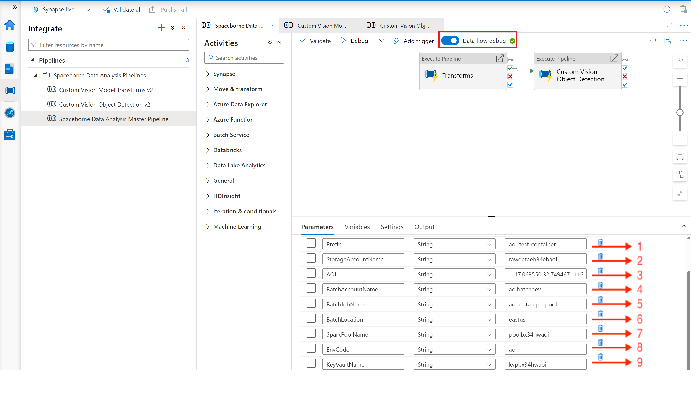

If you've landed on this page from Synapse gallery then Congrats! -- you are in the right place.

The instructions on this page will guide you through configuring the pipeline template to successfully run a custom vision model for object detection (for example, detecting swimming pool objects). You can also use the pipeline template to explore other object detection use cases as well. Currently, the template only supports custom vision model v2. 

**Prerequisites**

* Follow the steps in the [readme](https://github.com/Azure/Azure-Orbital-Analytics-Samples/blob/main/deploy/README.md) to deploy the infrastructure. This includes creation of the custom vision model v2 package as well. 

* Run the following command to create the linked services and spark job definition on the Synapse workspace: 

	```
	./deploy/gallery/create_service.sh <environmentCode> 
	```

	NOTE	
	**environmentCode** should be the same as the one used in the deployment steps

* Run the following command to copy the sample GeoTiff image and the required configurations into the storage account for detecting swimming pools using the Object Detection CV model: 

	```
	./deploy/scripts/copy_geotiff.sh <environmentCode>
	```
 
**Switch back to Synapse gallery**

1. The input page appears:
   
   

2. Select the values from the dropdown as shown below and click **Open pipeline**:

    

3. On the right side, there is a list of mandatory fields. Click each of them and select the respective names from the dropdown as shown below. This additional step is only interim; we are working with the Synapse product group for a long term fix.

- Transforms

    

 - Pool Geolocation
     
 
 - Copy Tiles
 
    

- Copy Config file
 
    

- Copy Xml from Convert Transform
 
    

4. When all the required fields are provided as shown on the right side of the image below, go ahead and publish.

    

5. When published successfully, you are just one step away from running the pipeline. Enable the Integration Runtime by moving the **Data flow debug** toggle button. While this is warming up, enter the value for the parameters.

    
   

    |No |Parameter | Value | Comments |
    |--| ---- | --- | ------- |
    | 1|Prefix| \<environmentCode>-test-container     |          |
    | 2|StorageAccountName|  rawdata<6-character-random-string>  |    Get the storage account name from \<environmentCode>-data-rg |
    | 3|AOI     |   -117.063550 32.749467 -116.999386 32.812946    | Sample bounding box |
    | 4|BatchAccountName | | Get the batch account name from \<environmentCode>-orc-rg |
    | 5|BatchJobName | \<environmentCode>-data-cpu-pool | Get the jobname from the batch account|
    | 6|BatchLocation | | Get the region from the batch account. Usually be the deployment region|
    | 7|SparkPoolName | pool<6-character-random-string>| Get the spark pool name from \<environmentCode>-pipeline-rg | 
    | 8|EnvCode | \<environmentCode> | Same as used in the deployment steps| 

6. All set to start the pipeline now. Press **Debug**.

