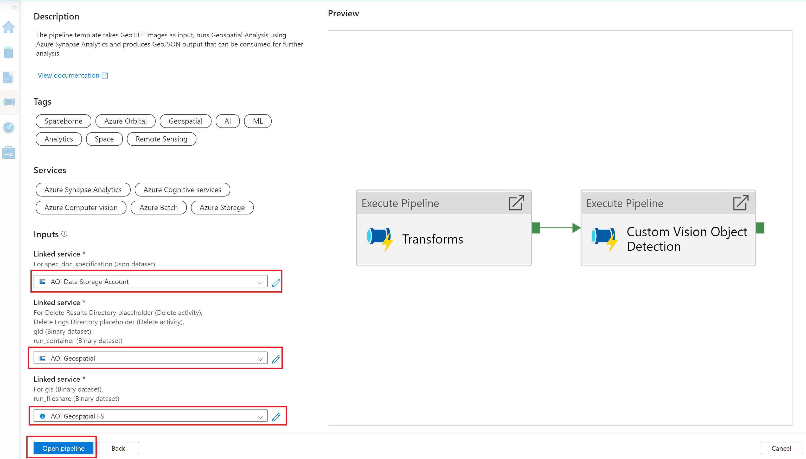
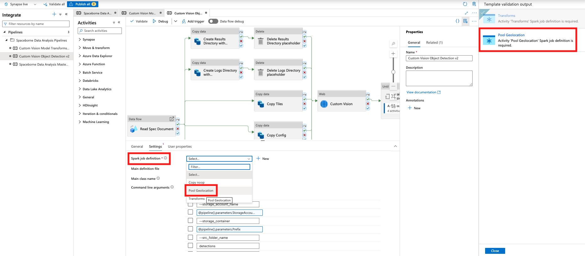

If you've landed on this page from Synapse gallery, we assume you have the required infrastructure and the Custom Vision model package ready. If this is true proceed further else visit the [infrastructure deployment](https://github.com/Azure/Azure-Orbital-Analytics-Samples/tree/main/deploy#infrastructure-deployment) section and provision the required infrastructure and the package. 

The instructions on this page will guide you through configuring the pipeline template in the gallery to successfully run a custom vision model for object detection (in this case, swimming pool).

**Prerequisites**

* Run the following command to create the linked services and spark job definition on the Synapse workspace. Occasionally, you may notice some failure whilst creating the linked services. This is due to an on going issue with az cli, please re-run the command, if you encounter it.

	```bash
	./deploy/gallery/create_service.sh <environmentCode> 
	```

	NOTE	
	**environmentCode** should be the same as the one used in the deployment steps

* Run the following command to copy the sample GeoTiff image and the required configurations into the storage account for detecting swimming pools using the Object Detection CV model.

	```bash
	./deploy/scripts/copy_geotiff.sh <environmentCode>
	```
 
**Switch back to Synapse gallery**

1. The input page appears as shown below. 
   
   

2. Select the values from the dropdown as shown below and click **Open pipeline**.

    

3. On the right side, there is a list of mandatory fields. Click each of them and select the respective names from the dropdown as shown below. This additional step is only interim; we are working with the Synapse product group for a long term fix.
   
   - Transforms

        

    - Pool Geolocation
        
        
 
4. When the mandatory fields are populated, turn on `Data flow debug`. While this is warming up, enter the value of the parameters as shown below and **Publish** to save the changes.

    

    |No |Parameter | Value | Comments |
    |--| ---- | --- | ------- |
    | 1|Prefix| \<environmentCode>-test-container     |          |
    | 2|StorageAccountName|  rawdata<6-character-random-string>  |    Get the storage account name from \<environmentCode>-data-rg |
    | 3|AOI     |   -117.063550 32.749467 -116.999386 32.812946    | Sample bounding box |
    | 4|BatchAccountName | | Get the batch account name from \<environmentCode>-orc-rg |
    | 5|BatchJobName | \<environmentCode>-data-cpu-pool | Get the jobname from the batch account|
    | 6|BatchLocation | | Get the region from the batch account. Usually be the deployment region|
    | 7|SparkPoolName | pool<10-character-random-string>| Get the spark pool name from \<environmentCode>-pipeline-rg | 
    | 8|EnvCode | \<environmentCode> | Same as used in the deployment steps|
    | 9|KeyVaultName | kvp<10-character-random-string>| Get the name from \<environmentCode>-pipeline-rg |

5. All set to start the pipeline now. Press **Debug**.

