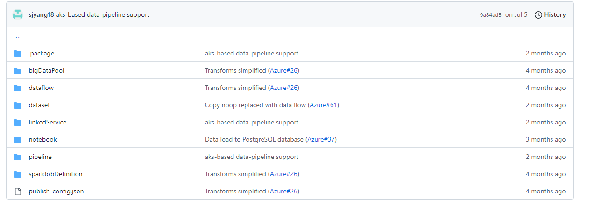
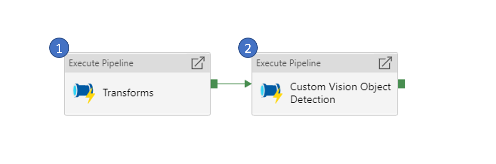
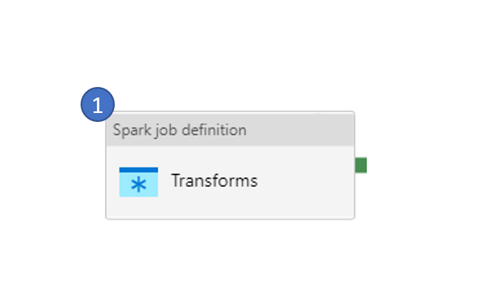
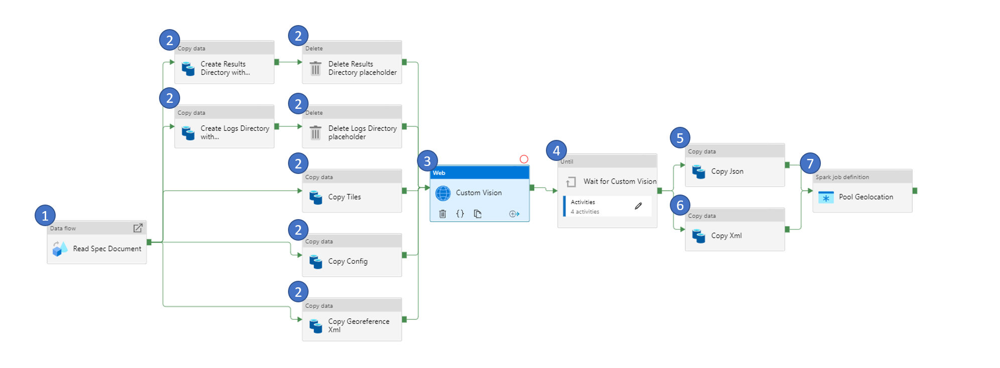
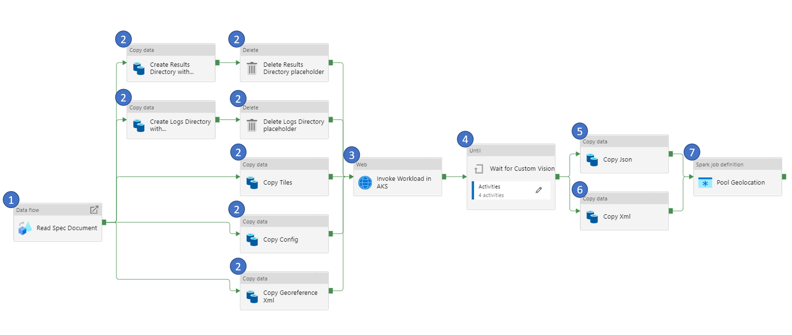

# Pipeline Activities

The purpose of this document is to provide a detailed walkthrough of the Synapse pipeline including the child pipelines, activities and their parameters. As we discuss each pipeline, their corresponding pipeline and supporting files checked in this repository will be linked under each topic. 

## Pipeline Folder Structure

All supporting files for the pipeline are checked in to the [Workflow](../src/workflow) folder. Below is the folder structure.

The folder structure is defined by Azure Synapse Analytics service when exporting your Synapse pipeline to a ZIP file or checking them to a Github/Azure DevOps repository. A quick overview of each folder is in the table below:

No | Folder | Purpose 
---|------|----------
1 | .package | An internal folder for Synapse pipeline to hold package manifest files
2 | bigDataPool | Contains JSON definition files to create Spark pool
3 | dataflow | Contains JSON definition files to create dataflows in Synapse Workspace
4 | dataset | Contains JSON definition files to create datasets in Synapse Workspace
5 | linkedService | Contains JSON definition files to create Linked Services in Synapse Workspace
6 | notebook | Contains JSON definition files to create Notebooks in Synapse Workspace
7 | pipeline | Contains JSON definition files to create pipelines in Synapse Workspace
8 | sparkJobDefinition | Contains JSON definition files to create Spark Job definitions in Synapse Workspace
9 | publish_config.json | Contains configuration details such as the branch in your repository to use as pubish branch

**Note:** Individual files and folders in the [Workflow](../src/workflow) parent folder are not intended to be imported into your workspace individually. You will need to run the `package.sh` in the deploy folder to create the zip file and then use the contents of the zip files to check-in your code to a repository.

## Main Pipeline

Two variants of the pipeline are available. 

a. First variant of the [pipeline](../src/workflow/custom-vision-model-v2/pipeline/E2E%20Custom%20Vision%20Model%20Flow.json) uses [Azure Batch Account]() to run AI Model as a container to process the raster data and provide the output.  
b. Second variant of the [pipeline](../src/workflow/custom-vision-model-v2/pipeline/E2E%20Custom%20Vision%20Model%20Flow_aks.json) uses [Azure Kubernetes Service (AKS)]() to run AI Model as a container to process the raster data and provide the output.

You have the option to pick which Azure service will be used to run the AI Model at the time of deployment. Refer to the [README.md](../deploy/README.md) document to understand the deployment steps and options available during deployment.

The main pipeline contains two steps. 

- It starts by invoking the [Custom Vision Object Transform v2](../src/workflow/custom-vision-model-v2/pipeline/Custom%20Vision%20Model%20Transforms%20v2.json) pipeline to transform your data before it can be consumed by the AI Model.

- Next, the [Custom Vision Model Transform v2](../src/workflow/custom-vision-model-v2/pipeline/Custom%20Vision%20Object%20Detection%20v2.json) or [Custom Vision Model Transform v2_aks](../src/workflow/custom-vision-model-v2/pipeline/Custom%20Vision%20Object%20Detection%20v2_aks.json) pipeline is triggered to process the data through the AI Model running as container in either Azure Batch Account or Azure Kubernetes Services respectively. 

For Custom Vision model, the output is a set of JSON files that contains the location of the swimming pools detected in the image passed to the AI Model as 512 by 512 images. 

The final steps is to process the location of the detected swimming pools into geolocation (latitude, longitude). This will be explained in detail later in this document as we dive deeper into each child pipeline.

## Custom Vision Model Transform

This is a simple, one-activity pipeline that serves one purpose. It transforms the raw raster geotiff (Aerial Imagery) and outputs a set of 512 by 512 tiles of PNG file format. 

To convert the raw raster geotiff, it first stitches the geotiff (in case there are more than one geotiff to be processed), crops the geotiff to the Area of Interest, converts geotiff to PNG and finally tiles them to 512 by 512 sizes.

Below are the parameters for this pipeline:

No | Parameter | Purpose 
---|------|----------
1 | Prefix | This refers to the Storage Account Container created for the specific pipeline run. Refer to the [README.md](../deploy/README.md) document to understand the steps to run the pipeline.
2 | StorageAccountName | Name of the Storage Account where the data is stored
3 | AOI | Area of Interest refers to specific geographic extent to focus the analysis

Inside the pipeline, there is one activity that submits a Spark Job to the Azure Synapse Spark Pool provisioned by the Bicep template. The Spark Job takes the below parameters as input:

No | Parameter | Purpose 
---|------|----------
1 | storage_account_name | Name of the Storage Account where the data is stored
2 | storage_container | Name of the Container in the Storage Account where the data is stored
3 | key_vault_name | Name of the Key Vault where the secrets related to the pipeline are stored. There is only one Key Vault provisioned through the Bicep template. This is the Key Vault that will be used to store for all pipeline related secrets
4 | storage_account_key_secret_name | Access Key for the Storage Account is stored as a secret in Key Vault. This parameter is used to pass the name of the secret in the Key Vault that holds the access key
5 | linked_service_name | Synapse allows adding certain services like Key Vault, Storage Account, etc as Linked Service. This parameters is used to pass the name of the Key Vault added to the Synapse instance as linked service. 
6 | aoi | Area of Interest refers to specific geographic extent to focus the analysis

## Custom Vision Model Detection (Using Azure Batch Account)

This is the core of the pipeline where the actual AI Model is run against the data submitted to the pipeline. The steps prior to this pipeline, prepares the data to be in a format that is consumable by the AI Model.

The AI Model is packaged as a [Container Image](https://github.com/Azure/Azure-Orbital-Analytics-Samples/pkgs/container/azure-orbital-analytics-samples%2Fcustom_vision_offline) that is publicly available to be pulled and run locally on your Azure Batch Account or Azure Kubernetes Service.

Below are the parameters for this pipeline:

No | Parameter | Purpose 
---|------|----------
1 | Prefix | This refers to the Storage Account Container created for the specific pipeline run. Refer to the [README.md](../deploy/README.md) document to understand the steps to run the pipeline.
2 | BatchName | Name of the Azure Batch Account where the AI Model container will be run
3 | JobName | Name of the Job inside the Azure Batch Account where the AI Model container will be run
4 | BatchLocation | Location/Region where the Batch Account is provisioned. For Example - for East US region, use **eastus**
5 | StorageAccountName | Name of the Storage Account where the data is stored

**1. Read Spec Document**

As the name suggests, this activity reads the spec (specification) document. 

A **specification document** is a JSON file that defines the parameters for running the AI Model container. It includes location of the image, credentials to pull the image, path to look for input file, output file path, log file path, CPU, GPU and memory among other parameters that define the minimal runtime environment.

Data read from the spec document will be used as parameter to one or more of the activities in the later part of the pipeline.

No | Parameter | Purpose 
---|------|----------
1 | filename | Name of JSON specification document
2 | folderpath | Name of the folder that contains the JSON specification document. This is relative folder path (relative to the container in Azure Storage Account)
3 | containername | Name of the container that contains the JSON specification document

**2. Copy and Delete File(s)**

Data for the AI Model is in a Container in Azure Storage Account. For the AI Model, the data needs to be copied to a File Share in Azure Storage Account. This set of steps serves to copy the input files from the Containers to File Shares in the Storage Account.

There is also a need to create empty Folders like output folder and log folder what will be used by the AI Model to store the outputs and logs after running the AI Model. However, since Azure Data Factory (ADF) activities do not allow creation of empty folders, we create placeholder files under the folder and then delete the placeholder file to create the empty folder.

No | Parameter | Purpose 
---|------|----------
1 | container_name | Name of the destination container in Azure Storage Account where the files are to be copied
2 | folder_path | Name of the destination folder in Azure Storage Account where the files are to be copied

**3. Custom Vision kick off**

During this step, the container is scheduled in Azure Batch Account to run as a task. This is done by calling the Azure Batch Account API and sending the parameters required.

**Note:** There is no specific custom parameters defined for this activity.

**4. Wait for Custom Vision**

The previous step kicks off the task in Azure Batch Account and exits. AI Model takes several minutes to hours to complete depending on the input file sizes. This steps monitors the AI Model running in the Azure Batch Account to check if they are complete. This set of activities are set to run in a loop and exit only if the AI Model completes.

**Note:** There is no specific custom parameters defined for this activity.

**5. & 6. Copy File(s)**

At this stage of the pipeline, the AI Model is run and the output is available in File Share in Azure Storage Account. It needs to be copied from File Share to Container in Azure Storage Account. This step copies the output in JSON and XML format to the container in Azure Storage Account.

**Note:** There is no specific custom parameters defined for this activity.

**7. Pool Geolocation**

The output from running the AI Model (Custom Vision Model) gives the location of the Swimming pool in the tiles in terms of pixel location. This step converts the pixel location of the detected objects to the geolocation (latitude, longitude).

No | Parameter | Purpose 
---|------|----------
1 | storage_account_name | Name of the Storage Account where the input data is stored
2 | storage_container | Name of the container in Storage Account where the input data is stored
3 | src_folder_name | Name of the folder under the container in Storage Account where the input data is stored
4 | key_vault_name | Name of the Key Vault to use for pulling the secrets
5 | storage_account_key_secret_name | Name of the secret in Key Vault that stores the Access Key of Storage Account
6 | linked_service_name | Name of the Linked Service in Synapse which links the Key Vaults to Synapse

## Custom Vision Model Detection (Using Azure Kubernetes Service)

This pipeline performs the same functionality as the **Custom Vision Model Detection (Using Azure Batch Account)**. However, it uses Azure Kubernetes Service in place of Azure Batch Account to run the AI Model.

The pipeline remains the same as the **Custom Vision Model Detection (Using Azure Batch Account)**. There are two activities that are changes to accomodate the switch from Azure Batch Account to Azure Kubernetes Service. **We'll discuss only the components that are different in this pipeline.**

**3. Invoke Workload in AKS**

During this step, the container is scheduled in Azure Kubernetes Service to run as a job. This is done by calling the Azure Kubernetes Service API and sending the parameters required.

**Note:** There is no specific custom parameters defined for this activity.

**4. Wait for Custom Vision**

The previous step kicks off the task in Azure Kubernetes Service and exits. AI Model takes several minutes to hours to complete depending on the input file sizes. This steps monitors the AI Model running in the Azure Kubernetes Service to check if they are complete. This set of activities are set to run in a loop and exit only if the AI Model completes.

**Note:** There is no specific custom parameters defined for this activity.
