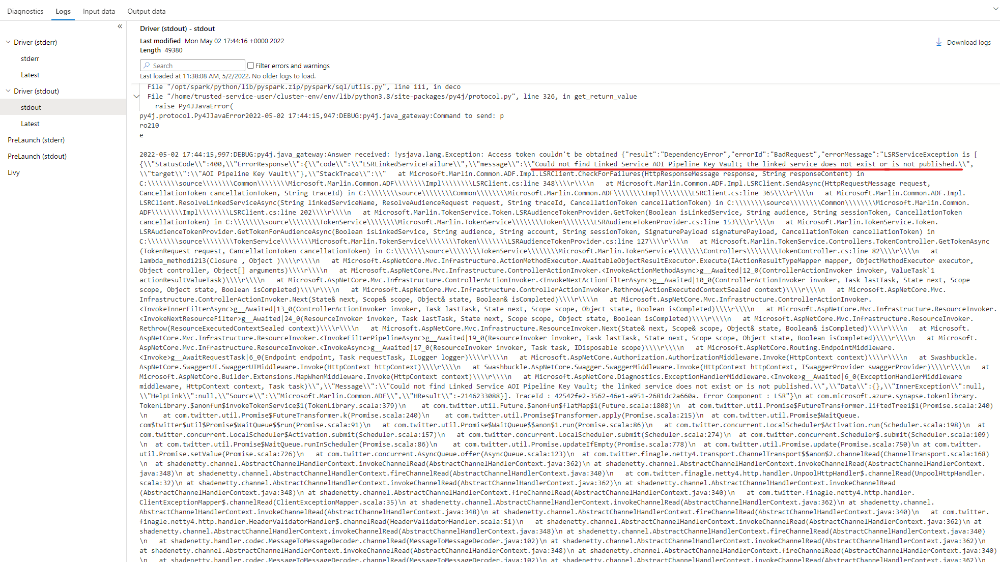

# Spark Job Troubleshooting

## Invalid Area of Interest passed as parameter

Error:

raise ValueError('Input shapes do not overlap raster.')
ValueError: Input shapes do not overlap raster.

Cause:

You have submitted a raster file (tif) that does not have any portion of its data falling within the Area of Interest (AOI) that you passed as a parameter.

Solution:

- Verify the aoi parameter passed.
- Verify the Raster file that you have submitted.

## Missing / Invalid reference to Linked Services (Key Vault)

Error: 

Access token couldn't be obtained {"result":"DependencyError","errorId":"BadRequest","errorMessage":"LSRServiceException is [{
    "StatusCode":400,
    "ErrorResponse":{
        "code":"LSRLinkedServiceFailure","message":"Could not find Linked Service AOI Pipeline Key Vault; the linked service does not exist or is not published.","target":"AOI Pipeline Key Vault"
        }
    ...
    }] 
...
}

Cause:

Linked Services need to be published to be able to use them in your pipeline either via Spark Job Definition or ADF Activity.

Solution:

After importing your pipeline from your repository or pipeline template approach, please use "Publish" or "Publish All" to publish your pipeline and its associated components like Linked Services.

