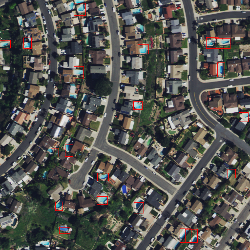

# Custom Vision Model

In this Sample solution and the custom vision model implementation, we take input as WGS84 GeoTiff and transform the image using (optionally) Mosaic, Crop, convert to PNG and create chips of this image. These chipped images are passed to custom vision model as an input along with the [specification document](./specs/custom_vision_object_detection.json). This CV model provides an output as json files providing the details of the objects identified

## What does this model do?

This model detects swimming pools in a given Area of Interest. 

## What are the inputs and outputs?

A number of small images in PNG format of size 512 x 512 (or 1024 x 1024) can be passed to the model as input. The input CRS is WGS84 with data from moderate to high resolution image source.

The output contains a number of files that are stored in sub-folders of three file types:

* Images in PNG format, the same as the input file unmodified by the AI Model.
* GeoJson files that contain the image coordinates for a specific PNG tile (512 x 512 or 1024 x 1024 image).
* XML file that holds the geolocation / reference information in latitude & longitude.

## Are additional transformations / processing of output required?

Yes, the output contains the pool location in the image coordinates that needs to be converted into a geolocation. A transformation named `pool-geolocation` is used to perform the final conversion from image coordinates to geolocation.

## Transforms 

The following transforms are used in this sample solution. Some of these transformations are AI model specific and some are data source specific. 

* Mosaic - stitch multiple geotiff files into one single geotiff file.
* Crop - crop the geotiff to the Area of Interest represented as polygon.
* Convert to PNG - convert the geotiff to PNG file format.
* Chipping - cuts the large PNG file into multiple smaller PNG files (512 x 512 or 1024 x 1024).

# Custom Vision Container Overview

### Overview
This container allows users to pass images through General (Compact) Domain Azure Custom Vision Object Detection model and retrieve the predictions from that model. Users can Train the Model using Custom Vision and then export the trained model as a container from Custom Vision Portal and place the contents of app folder inside src folder.

This containers runs in an offline manner and does not require communication with custom vision service. Inference is done within the container and specifically, two outputs are returned to user :


* JSON - One JSON is returned for every image passed through the Custom Vision model. This JSON contains <b>all</b> model detections for the given image. For example, an image passed through a pool detection Custom Vision model will return the following JSON with one detection:
    ```json
    {
    "id": "e8526e8a-6e9a-433f-9ff2-0820f18ffc9a",
    "project": "c3c8d02c-e05c-49ea-9a87-fb85975233a9",
    "iteration": "cb0011d3-9e9b-4d1e-abf2-4fe51b588520",
    "created": "2021-03-19T01:39:39.675Z",
    "predictions": [
        {
        "probability": 0.9973912,
        "tagId": "00005547-553e-4058-a5a2-cafe7e5c822d",
        "tagName": "pool",
        "boundingBox": {
            "left": 0.9580524,
            "top": 0.7763942,
            "width": 0.02493298,
            "height": 0.035517573
        }
        }
    ]
    }
    ```

* Image - A new image is also stored in a directory with all detections (that are above a user specified probability threshold) highlighted as in this example:

    

### Model Configuration
Model selection and specifications are defined in the`/app/data/config.json` file. Within this file users can define:

* prob_cutoff - The threshold a detection must meet in order for its bounding box to be drawn on the output image (note all detections will still be included in the JSON regardless of their probability).
* tag_type - The type of tag (given that custom vision models can be trained on multiple tags) that should be highlighted in the output image. This should be one of the entries found in `labels.txt` under `src` folder.
* bbox_color - The color of the bounding boxes around detections in the output image (default is red)
* bbox_width - The width of the bounding boxes around detections in the output image (default is 1)


### Docker Build & Run
In order to build and run the container use the included `build.sh` and `run.sh` files. Within the run.sh:

- Input files are provided at container runtime by mounting the local folder with images in the container’s `/app/data/in` directory.
- The user's local config file is mounted in the container at `/app/data/config.json`
- Output files are written to the container's `/app/data/out` which can be mounted to a local output folder

# Attributions And Disclaimers
- Images located in [examples](./container/examples/in/) folder used for testing the model are attributed to NAIP Imagery available via [Planetary Computer](https://planetarycomputer.microsoft.com/explore?c=-117.0520%2C32.8127&z=18.49&r=Natural+color&d=naip&m=Most+recent+available) They are covered under [USDA](https://ngda-imagery-geoplatform.hub.arcgis.com)

- Following files located in the `container/src` folder are exported from Azure Custom Vision Portal and included as is to demonstrate use of Custom Vision Model with Synapse Pipeline. Users can use this container as wrapper for their own exports of models from Azure Custom Vision in similar manner. 
    * `app.py`
    * `object_detection.py`
    * `predict.py`
    * `labels.txt`
    * `model.pb (this includes model weights)`
    * `metadata_properties.json`
